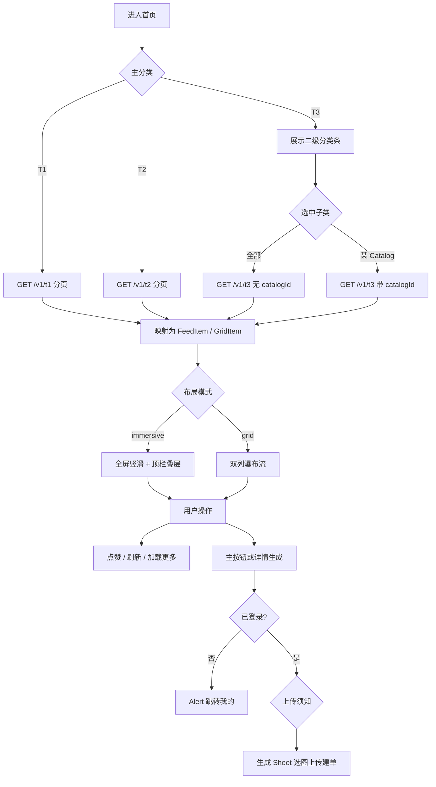
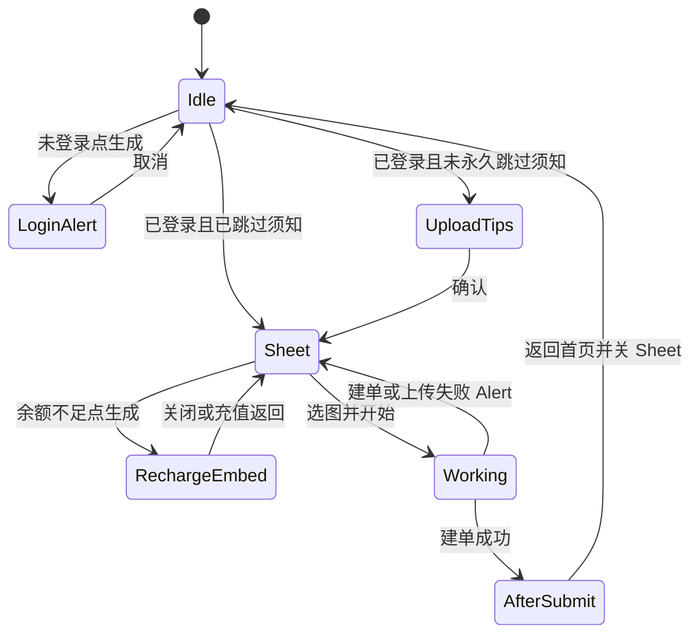
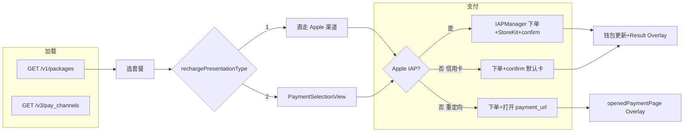
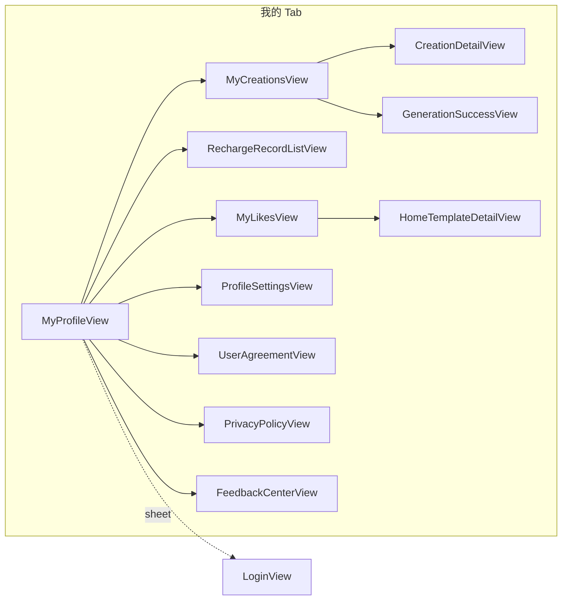

# 需求开发文档（bbb）

> 本文档依据当前代码库实现与业务约定整理，用于对齐产品、设计与研发。项目：**bbb**（SwiftUI / iOS）。

---

## 1. 项目概述

### 1.1 产品定位

面向 C 端的 **AI 模板生成类** 应用：用户浏览图片/舞蹈/视频模板，上传素材后创建异步生成任务，通过金币体系完成付费与增值；支持收藏、创作列表与任务状态跟踪。

### 1.2 客户端形态

- **界面框架**：SwiftUI，全局 **深色模式**（`preferredColorScheme(.dark)`）。
- **主导航**：底部三 Tab — **首页**、**充值**、**我的**；子页面进入二级栈时隐藏底部 TabBar，与系统行为对齐。
- **状态注入**：`UserWalletStore`、`AuthSessionStore`、`AppTabRouter`、`VersionConfigStore`、`AppLanguageStore` 等通过 `environmentObject` 下发。

---

## 2. 功能需求

### 2.1 启动与账号

| 需求项 | 说明 |
|--------|------|
| 冷启动鉴权 | 启动时拉取版本配置、执行 `ensureAuthenticatedOnLaunch`（含 Token 恢复或设备登录）；401 时由 `TokenManager` 刷新。 |
| 登录态展示 | `AuthSessionStore` 维护 `isAuthenticated`、`userId` 等；未登录与已登录流程按现有「我的」与任务创建门禁实现。 |
| 欢迎奖励 | 首次登录成功后展示欢迎金币 overlay（如免费金币），展示后写入 `AppStorage`，不再重复。 |

### 2.2 首页（模板发现）

首页承担 **模板浏览、筛选、双形态列表、点赞、发起生成、跳转充值/创作** 等能力；实现以 `HomeView` 为编排中心，沉浸式列表与网格共用同源模板数据，映射为 `HomeFeedItem` / `HomeGridCardItem`。

#### 2.2.0 首页业务流程与逻辑总览

本节从 **用户目标 → 系统状态 → 数据与界面响应** 串联首页逻辑，便于产品与研发对齐；细项仍见下文各小节。

**用户目标**：在三大主分类下浏览模板，可选视频二级分类；在 **沉浸式** 或 **网格** 两种布局间切换并保持浏览锚点；对模板点赞；对单条模板发起 **生成**（经登录、可选上传须知、选图上传与建单）；从顶栏进入 **充值**；在网格中进入 **模板详情** 再生成。

**核心状态（相互约束）**

| 状态维度 | 取值 / 持久化 | 对行为的影响 |
|----------|----------------|--------------|
| 主分类 | 图片 T1 / 舞蹈 T2 / 视频 T3 | 决定列表数据源：`/v1/t1`、`/v1/t2`、`/v1/t3`；仅 T3 启用二级分类条。 |
| 视频二级分类 | 「全部」或某一 `Catalog`（`catalogId`） | 仅 T3 生效；选中「全部」时不传 `catalogId`，否则请求带 `catalogId`。 |
| 布局模式 | `immersive` / `grid`，`AppStorage` | 切换时做 **锚点同步** 与 **转场动画**；两种布局共用同一套模板列表数据。 |
| 列表分页 | `page`、`hasMore`、各 Tab 的 fetch epoch | 触底加载更多；Video 子类或 epoch 变化时丢弃过期响应。 |
| 登录 / 钱包 | `AuthSessionStore`、`UserWalletStore` | 生成前门禁；顶栏展示余额；建单成功本地扣币与服务端同步纠偏。 |

**数据加载触发（首页内）**

1. **进入首页 / 冷启动后首次展示**：按当前主分类（及 T3 的 `catalogId`）拉取模板列表第 1 页；必要时同步金币（已登录）。
2. **切换主分类（T1/T2/T3）**：重置分页，拉取对应接口列表；T3 时并行或优先保证 `catalogs` 与子分类选中态一致后再拉 `/v1/t3`。
3. **仅 T3 切换二级分类**：更换 `catalogId`（或清空），从第 1 页重拉 `/v1/t3`。
4. **下拉刷新**：强制刷新分类（若适用）并 **重拉当前列表第 1 页**。
5. **应用内语言切换**：重拉分类与模板列表，保证文案与数据与 locale 一致。
6. **从其他 Tab 切回首页**：可延迟再拉一次余额，避免与首帧滚动布局竞争。

**用户操作 → 系统响应（摘要）**

| 操作 | 逻辑要点 |
|------|----------|
| 点击顶栏布局按钮 | 在 immersive / grid 间切换，`UserDefaults` 持久化；双向 **锚点同步**（见 2.2.2 节）。 |
| 滑动沉浸式列表 / 网格滚动 | 更新可见条标识，用于 **滚动位置记忆**、**模板曝光埋点**（去重集合按列表维度维护）。 |
| 点赞 | 与本地收藏 store 及登录用户维度同步；UI 即时反馈。 |
| 沉浸式主按钮 / 详情「使用模板」 | 统一走 **登录门禁 →（可选）上传须知 → 生成 Sheet**；埋点区分 `list_source`。 |
| 点击顶栏金币 | 切换到 **充值** Tab。 |
| 网格点击卡片 | Push 详情，`homeNavigationStackCount` 增加，**隐藏底部 TabBar**；返回栈清空后恢复 TabBar。 |

**首页内「发起生成」门禁顺序（与 2.4 节一致，此处只标串联关系）**

未登录 → Alert，可去「我的」登录。已登录且未勾选「不再提示」→ `HomeUploadTipsOverlay`。确认后（或已跳过）→ `HomeTemplateGenerationSheet`；余额不足时内嵌充值引导；建单成功后轮询 / WebSocket，首页可出现 **生成中横幅**（条件见 2.2.7、2.4.7）。**各层弹窗与 Overlay 的对照表** 见 **2.2.11 节**。

#### 2.2.1 信息架构与主导航

| 需求项 | 说明 |
|--------|------|
| 三大主分类 | 顶部一级分段：**图片（T1）**、**视频（T3）**、**舞蹈（T2）**，文案走多语言键（如 `home.primary.image` / `video` / `dance`）。 |
| Video 专属二级分类 | 仅当主分类为 **视频** 时展示二级标签条：首项为「全部」（**不传** `catalogId`），其余项对应 `GET /v1/catalogs` 返回的 `Catalog`，选中后带 **`catalogId`** 请求 `/v1/t3`（`titleId` 与接口约定一致，实现中与 `TemplateAPI` 注释一致）。 |
| Image / Dance | **不展示**二级分类条；列表为 **`/v1/t1`、`/v1/t2` 分页数据**，当前实现 **不按 Catalog 做客户端过滤**（`templatesMatchingCatalog` 仅在选中 Video 子分类时传入非空 `Catalog`）。若产品后续要对 T1/T2 做「标题与分类名」本地筛选，可复用已有匹配函数并扩展 `selectedCatalog` 语义。 |

#### 2.2.2 双布局模式（沉浸式 / 网格）

| 需求项 | 说明 |
|--------|------|
| 模式定义 | `HomeLayoutMode`：**immersive**（全屏竖滑信息流，顶栏叠在内容上方）、**grid**（顶栏 + 下方双列瀑布流）。用户选择持久化至 `AppStorage`（如 `bbb.home.layoutMode`）。 |
| 切换入口 | 顶栏左侧按钮：沉浸式显示「列表」图标，网格显示「网格」图标；切换时使用统一转场动画（`HomeLayoutTransitions`），避免与内部 `UIScrollView` 冲突（不对整页滥用 `scaleEffect`）。 |
| 锚点同步 | **沉浸式 → 网格**：将当前可见条对应模板 `id` 传给网格，滚动至相近位置。**网格 → 沉浸式**：根据网格当前可见区域锚点 `likeStateKey` 恢复大列表滚动位置（`immersiveScrollRestoreKey`）。 |
| 滚动位置记忆 | 沉浸式可见条 `likeStateKey` 按「主分类 + Video 子分类」维度写入 `UserDefaults`，冷启动恢复对应列表的浏览进度。 |
| 首启引导 | 首次切换布局可展示简短 **布局说明 Tooltip**（`layoutHintSeen`）；沉浸式下滑 **超过第 8 条** 后可触发 **「切换为小列表」引导气泡**（仅一次，`homeGridSwitchGuideSeen`），约 **6 秒**自动收起；用户点击左上角布局切换也视为已引导。 |

#### 2.2.3 数据加载、缓存与分页

| 需求项 | 说明 |
|--------|------|
| 数据源 | 经 **`TemplateRepository`** 访问接口（含磁盘缓存与后台刷新策略），减少重复请求。 |
| 分页 | 列表统一 **每页条数**（如 10）；首屏/下拉刷新为第 1 页，触底 **加载更多**；`hasMore` 结合接口 `total` 或本页是否满页推断。 |
| 各 Tab 策略 | **Image**：`onlyIfEmpty` 时若已有缓存则不重复拉网。**Video**：子分类变化或 `catalogs` 数量变化时重拉；带 **fetch epoch** 丢弃过期响应。**Dance**：分页逻辑与 Image 类似。 |
| 下拉刷新 | 沉浸式与网格均支持 `onRefresh`：**强制刷新分类** + **重拉当前主分类模板列表**。 |
| 语言切换 | 用户应用内语言变更时，**重新拉分类与模板列表**，保证标签与数据与 locale 一致。 |

#### 2.2.4 顶栏与底部安全区

| 需求项 | 说明 |
|--------|------|
| 顶栏内容 | **布局切换**、中间 **三大主分类**、右侧 **金币余额**（点击跳转 **充值 Tab**）。沉浸式模式下信息流可延伸至顶栏后方，顶栏为半透明渐变，避免遮挡封面。 |
| 窄屏适配 | `compact` 宽度下缩小主分类字号与间距，并通过 **ZStack 层级** 保证左右按钮可点（中间 `Spacer` 不参与命中），避免 Tab 文案遮挡菜单/金币。 |
| 底部留白 | 列表底部增加 **动态 padding**：取 `GeometryReader` 上报的 `safeAreaInsets.bottom` 与 **自定义 TabBar 估算高度** 的较大值，避免内容被 TabBar 遮挡；**上传提示**等全屏 overlay 打开时 **冻结**打开前的 bottom padding，防止布局跳动。 |

#### 2.2.5 沉浸式列表（`HomeImmersiveFeedView`）

| 需求项 | 说明 |
|--------|------|
| 内容形态 | 每条对应 `HomeFeedItem`：**多图轮播**、T2/T3 时 **成片视频循环**（见 `playbackVideoURL`）、主操作按钮文案与金币展示。 |
| 交互 | **点赞/取消点赞**（与 `LocalFavoriteTemplateStore`、登录用户维度同步）；**主按钮** 发起生成流程；首屏可展示滚动提示。 |
| 转场资源顺序 | 轮播 URL 序列与间隔由接口 **`transAnimation`** 与 `before*` / `after*` 字段共同决定，规则见 **2.3 节**。 |
| 空态 / 错态 | 加载中全屏占位；失败且列表为空时展示错误文案；加载更多与列表内骨架/脚由子视图处理。 |

#### 2.2.6 网格列表（`HomeGridFeedView`）

| 需求项 | 说明 |
|--------|------|
| 展示 | 双列 `HomeGridCardItem`（封面、点赞态等）；首屏加载可用 **骨架屏**（`showSkeleton`）。 |
| 进入详情 | 点击卡片 **Push** `HomeTemplateDetailView`（`NavigationView` + `NavigationLink`）；此时 **`tabRouter.homeNavigationStackCount`** 递增，**隐藏底部 TabBar**。 |
| 详情内生成 | 详情页「使用模板」回调关闭详情并回到首页逻辑中的 **主流程生成**（可区分来自网格的 `list_source`）。 |

#### 2.2.7 发起生成与登录门禁

| 需求项 | 说明 |
|--------|------|
| 主按钮 | 沉浸式主按钮、网格详情内使用模板、以及通知 `homeRequestPrimaryGenerate` 触发的生成，均汇聚到统一处理函数。 |
| 未登录 | 弹出 Alert，可跳转 **我的** Tab 登录，或取消。 |
| 上传提示 | 非「不再提示」时，可先展示 **上传须知 Overlay**（`HomeUploadTipsOverlay`），确认后再 **`sheet` 打开 `HomeTemplateGenerationSheet`**；关闭 overlay 时恢复冻结的底部 inset。 |
| 生成中横幅 | 当 `TaskPollingService` 认为 **生成进行中** 且用户未手动关闭时，在首页底部 TabBar 上方展示 **胶囊横幅**，可跳转 **我的创作 · 生成中**（`AppTabRouter.openMyCreations`，见 **2.6.10 节**）；打开生成 Sheet 时暂停自动隐藏；**约 6 秒**自动收起横幅。 |
| 弹窗汇总 | 未登录 Alert、上传须知、Sheet、Sheet 内充值引导与错误 Alert、提交后全屏页、生成中横幅的 **触发与互斥** 见 **2.2.11 节**。 |

#### 2.2.8 埋点与运营

| 需求项 | 说明 |
|--------|------|
| 曝光 | 模板首次进入可视区域上报 `template_exposure`，`extra.list_source` 为 **`immersive`** 或 **`grid`**；切换主分类/子分类/布局时 **清空去重集合**，避免跨列表重复统计。 |
| 点击 | `template_click` 携带 `list_source` 与 `click_action`（如 `primary_generate`、`open_detail`）。 |
| 行为队列 | 事件入队 `BehaviorEventQueue`，异步上报。 |

#### 2.2.9 与其他模块的联动

| 需求项 | 说明 |
|--------|------|
| 钱包 | 进入首页 task 中若已登录则 **同步金币**；从其他 Tab **切回首页** 时延迟再拉一次余额，减轻与 `UIScrollView` 首帧布局竞争。 |
| 收藏通知 | 监听 `localFavoriteTemplateStoreDidChange`，刷新点赞集合。 |
| 资源预取 | Image 列表更新后可对 feed/grid 封面 URL 做预取（`prefetchHomeImageURLs`），提升首滑体验。 |

#### 2.2.10 资源与详情

| 需求项 | 说明 |
|--------|------|
| 资源基址 | 模板内相对路径经 `ResBaseURL` 拼成完整 URL；已是 `http(s)://` 则直接使用。 |
| 模板详情 | 网格进入 **`HomeTemplateDetailView`**；数据可来自列表项映射或详情接口（与 `TemplateAPI.get*Detail` 一致）。 |

#### 2.2.11 首页弹窗、Overlay 与提示（汇总）

首页相关 **模态与浮层** 分散在多个状态变量中，下表按 **呈现形态** 归纳触发条件、结束方式与和 **底部安全区 / 横幅** 的联动，避免实现时遗漏互斥关系。

| 名称 | 形态 | 触发条件 | 用户路径与结束条件 | 持久化 / 频控 |
|------|------|----------|-------------------|----------------|
| **未登录生成** | `Alert` | 未登录用户触发 **主按钮 / 详情使用模板 / `homeRequestPrimaryGenerate`** | **去我的** 切换 Tab 登录，或 **取消** 关闭；**不**打开上传须知与 Sheet | 无 |
| **上传须知** | 全屏 **`HomeUploadTipsOverlay`**（覆盖首页） | 已登录且 **`uploadTipsSuppressed == false`** | **确认** → 关闭 Overlay 后以 **`sheet` 打开** `HomeTemplateGenerationSheet`；可勾选 **不再提示** 写入持久化，后续跳过本层 | `uploadTipsSuppressed`（或等价键） |
| **布局说明 Tooltip** | 轻提示（非阻塞） | 用户 **首次** 通过顶栏 **切换布局**（immersive ↔ grid） | 阅后即关或自动消失（与实现一致） | `layoutHintSeen` |
| **切换网格引导气泡** | 气泡提示 | **沉浸式** 下已滑过 **第 8 条** 且未展示过引导 | 约 **6 秒**自动收起，或用户点击 **顶栏布局切换** 视为已引导 | `homeGridSwitchGuideSeen` |
| **生成 Sheet** | `.sheet` **`HomeTemplateGenerationSheet`** | 通过上传须知确认后呈现，或 **`uploadTipsSuppressed`** 已开启时 **直接** Sheet | 选图 → 上传 → 建单；**工作中**（`isWorking`）禁用关闭与重选图；成功则切到 Sheet 内 **提交后全屏页**（见下表） | 无（单次会话） |
| **Sheet 内 · 余额不足** | 内嵌 **`HomeGenerationRechargeUpsellView`** | `consumedCoins > 0` 且 **`wallet.coinBalance < consumedCoins`**（点击「开始生成」时预检） | **关闭** 留在 Sheet；或跳转 **充值 Tab**；弹层内下单与 **`rechargePresentationType`** 分支见 **2.5.10 节**；**不**发起上传与建单 | 无 |
| **Sheet 内 · 业务错误** | `Alert` | JPEG 编码失败、上传失败、建单失败、`userParams` 序列化失败等 | 用户点确定后回到 Sheet 可编辑态（若未 `isWorking`） | 无 |
| **提交后全屏生成** | Sheet 内全屏 **`HomeGenerationAfterSubmitView`** | `POST /v1/tasks` **成功** 并已 **本地扣币**、启动 `TaskPollingService` | 用户点 **返回首页** → 关闭 Sheet；期间展示排队 / 进度（见 2.4.6） | 无 |
| **首页 · 生成中横幅** | TabBar 上方 **胶囊条** | `TaskPollingService`：**进行中**（`pending`/`running`）且满足 **2.4.7 节** 与实现的「未手动关闭、非 Sheet 抢焦点」等条件 | 点击跳转 **我的创作 · 生成中**；**约 6 秒**自动收起；用户手动关闭后至 **任务结束或新任务** 前不再自动弹出 | 与横幅相关的「已手动关闭」等运行时标记（见实现） |

**与首页布局相关的约定**

- **上传须知**、**全屏类 Overlay** 显示期间：按 **2.2.4 节** **冻结**首页列表底部 padding，关闭时恢复，避免 `safeArea` 变化引起跳动。
- **生成 Sheet 打开** 或 **提交后全屏生成页** 展示时：暂停生成中横幅的 **自动隐藏计时**（或等价逻辑），避免与 Sheet 内状态 **重复打扰**；用户从提交后页 **返回首页并关闭 Sheet** 后，横幅再按 **2.4.7 节** 出现。
- **欢迎金币 Overlay**（见 **2.1 节**）属 **账号 / 全局** 级首次奖励，不一定由首页独占展示，但与「刚登录」时间接近时需避免与 **上传须知 + Sheet** 在同一帧堆叠；若产品要求严格顺序，应在实现中 **串行队列**（先欢迎 → 再浏览首页 → 再生成）。

### 2.3 转场与 `transAnimation`（核心规则）

接口字段 **`transAnimation`**（字符串）用于控制 **列表/沉浸式轮播顺序** 与 **轮播间隔**，规则如下。

#### 2.3.1 通用解析

- **路径列表**：按 **英文逗号** 拆分，trim 空白；片段若 **仅为数字**（且无 `/`、`:` 等路径特征），视为 **时间间隔占位**，**不**当作媒体路径。
- **轮播间隔**：若整段 `transAnimation` 可解析为数字：小数或 ≤50 的合理秒数按 **秒**；较大整数可按 **毫秒→秒** 换算（与 `HomeFeedItem.slideshowInterval(fromTransAnimation:)` 实现一致）；无法解析则用默认间隔（如 3.2s）。
- **媒体类型**：路径解析为 URL 后，按扩展名区分图片与视频（如 `mp4`、`mov`、`m4v`、`webm`、`mkv` 视为视频）。

#### 2.3.2 T1（图片模板）

| `transAnimation` | 轮播顺序 |
|------------------|----------|
| **非空** | `beforePics`（保序去重）→ **`transAnimation` 解析出的路径段**；**不**再追加 `afterPic`（目标帧由转场字段承载）。 |
| **空** | `beforePics` → **`afterPic`**（若存在且不重复）。 |

T1 **无**成片视频 URL；列表仅展示图片轮播。

#### 2.3.3 T2 / T3（舞蹈 / 视频模板）

| `transAnimation` | 轮播（配图） | 成片播放 URL |
|------------------|--------------|----------------|
| **非空** | `before` 阶段图片 + 快照等 → 再追加 **`transAnimation` 路径段**；其中图片进轮播列表，视频 URL 参与「成片」选择逻辑。 | 优先使用 **`transAnimation` 中解析到的视频**；若无视频片段则 **回退 `afterVideo`**（以当前 `HomeModels` 实现为准）。 |
| **空** | 轮播阶段仍为 before + snapshot 等组合 | 成片为 **`afterVideo`** |

> **注意**：若产品要求「`transAnimation` 非空时绝不允许回退 `afterVideo`」，需将成片逻辑改为仅使用解析出的视频，不再 `?? afterVideo`。

### 2.4 生成任务（端到端逻辑）

生成链路由 **入口触发 → 登录门禁 →（可选）上传须知 → 选图与上传 → 创建任务 → 本地扣币 → 任务状态跟踪 → UI 反馈** 组成；实现上 `HomeView` 负责入口编排，`HomeTemplateGenerationSheet` 负责选图/上传/建单，`TaskPollingService` 负责任务进度与 **WebSocket** 推送。

#### 2.4.0 生成链路总览（与首页的关系）

| 阶段 | 用户感知 | 关键组件 / 服务 |
|------|----------|-----------------|
| 触发 | 点击 **生成**（沉浸式 / 网格详情 / 通知入口） | `HomeView` 统一入口 |
| 门禁 | 未登录 → Alert；已登录 → 上传须知或直接 Sheet | 见 **2.4.1、2.4.2** |
| 填单与预检 | 选图、展示消耗金币、余额不足则内嵌充值引导 | **2.4.3** |
| 上传与建单 | 上传 `input` 图 → `POST /v1/tasks` | **2.4.3、2.4.4** |
| 扣费与轮询 | 建单成功 → 本地 `applyGenerationSpend` → `startPolling` | **2.4.5、2.4.6** |
| Sheet 内反馈 | 切换 **提交后全屏页**（排队 / 进度） | **2.4.7** |
| 回到首页 | 用户关闭 Sheet 后，首页可展示 **生成中横幅** | **2.4.7** 与 **2.2.11** |
| 终态 | WebSocket + `getTask` 校验成功 / 失败；成功后可 **刷新余额** | **2.4.5、2.4.6** |

**与首页弹窗的对应关系**：门禁与 Overlay 级说明见 **2.2.11 节**；本节侧重 **数据与任务状态**。

#### 2.4.1 入口与前置条件

| 需求项 | 说明 |
|--------|------|
| 主入口 | 首页沉浸式 **主按钮**、网格 **详情页「使用模板」**；埋点区分 `list_source`（见 2.2.8 节）。 |
| 外部入口 | 通知 **`homeRequestPrimaryGenerate`**（如「我的 · 点赞模板」详情等）统一投递 `HomeFeedItem`，由 `HomeView` 走与主按钮相同的 **登录 + 上传须知** 逻辑。 |
| 登录 | **未登录**时弹出 Alert，可跳转 **我的** Tab 登录；不打开生成 Sheet。 |
| 已登录 | 通过 `auth.isAuthenticated` 校验后进入下一步（上传须知或直接 Sheet，见 2.4.2）。 |

#### 2.4.2 上传须知（Upload Tips）

| 需求项 | 说明 |
|--------|------|
| 展示条件 | 用户 **未**在设置中勾选「不再提示」（`uploadTipsSuppressed`）时，打开全屏 **`HomeUploadTipsOverlay`**。 |
| 交互 | 用户确认后关闭 overlay，再 **`sheet` 呈现 `HomeTemplateGenerationSheet`**；可勾选「不再提示」并写入持久化，后续跳过此步直接打开 Sheet。 |
| 布局 | Overlay 显示期间 **冻结**首页底部 padding（见 2.2.4 节），避免 safeArea 变化导致整页跳动。 |

#### 2.4.3 生成 Sheet（`HomeTemplateGenerationSheet`）

| 需求项 | 说明 |
|--------|------|
| 内容 | 展示模板说明、**消耗金币数**（来自 `HomeFeedItem.consumedCoins`）、选图按钮、预览、**开始生成**主按钮。 |
| 选图 | 使用 **`LegacyImagePicker`** 选择单张图片到内存（`UIImage`）。 |
| 提交前编码 | 将图片压缩为 **JPEG**（质量约 **0.88**）；编码失败则提示错误，不发起上传。 |
| 金币预检 | 若 `consumedCoins > 0` 且 **`wallet.coinBalance < consumedCoins`**，展示 **`HomeGenerationRechargeUpsellView`**，可关闭或跳转 **充值 Tab**；不发起上传与建单。 |
| 上传 | 调用 **`UploadRepository.shared.uploadImage`**：`type` 为 **`input`**，文件名如 `face_{tid}.jpg`；支持 **最多 3 次**重试（指数退避）；**401** 与 **4xx** 客户端错误不重试。上传进度映射到 UI Progress（实现中将上传阶段映射到总进度前 **92%**）。 |
| 创建任务 | 上传成功后得到 **图片 URL 字符串**，构造 **`CreateTaskUserParams(inputImages: [url])`** → JSON 字符串 **`userParams`**；再发 **`CreateTaskRequest`**（见 2.4.4）。 |
| 建单成功 | **`wallet.applyGenerationSpend(coins:)`** 在本地扣减展示余额（**0 金币模板不扣**）；调用 **`TaskPollingService.shared.startPolling(taskId:)`**；切换为全屏 **「排队/生成中」** 视图（`HomeGenerationAfterSubmitView`），**不在此页自动关 Sheet**。 |
| 建单失败 | 展示 Alert，不扣币、不开始轮询。 |
| 工作中态 | `isWorking` 时禁用关闭、禁用选图；上传阶段可显示半透明遮罩与 Progress。 |

#### 2.4.4 创建任务接口与参数

| 需求项 | 说明 |
|--------|------|
| 路径 | `POST /v1/tasks`。 |
| 请求体 | `taskType`：与模板类型一致（**1=T1，2=T2，3=T3**，见 `TemplateResourceKind.apiTaskType`）；`tid`：模板 ID；`userParams`：**JSON 字符串**，内含 **`input_images`** 数组（上传后的资源 URL）。 |
| 响应 | 成功返回 **`taskId`**，客户端据此订阅任务状态。 |

#### 2.4.5 金币与余额一致性

| 需求项 | 说明 |
|--------|------|
| 展示余额 | `UserWalletStore.coinBalance` 为首页/Sheet 展示来源；充值成功或服务端同步会覆盖。 |
| 扣费时机 | **创建任务接口成功返回后** 在客户端执行 **`applyGenerationSpend`**，与模板标价一致；服务端实际扣费以接口为准，若不一致需靠 **`syncCoinBalanceFromServer`**（如切回首页）纠偏。 |
| 成功后刷新 | 任务 **成功**且 **`resultUrl` 有效** 时，`TaskPollingService` 内会调用 **`BalanceManager.shared.refreshBalance()`** 刷新余额（与 WebSocket 成功分支一致）。 |

#### 2.4.6 任务状态跟踪（`TaskPollingService`）

| 需求项 | 说明 |
|--------|------|
| 机制 | 以 **`WebSocket`** 推送为主：连接时使用 **`APIClient` 的 access token**；收到与当前 `taskId` 匹配的进度时更新状态。 |
| 状态枚举 | `pending`（排队）、`running`（生成中）、`success`、`failed`（与接口 `status` 整型一致）。 |
| 进度 | `running` 时服务端进度多为 **0–100**，客户端转为 **0.0–1.0** 展示线性进度条。 |
| 排队文案 | `pending` 时可展示 **等待时间**（实现中有默认如「~3 min」及本地化排队文案）。 |
| 成功校验 | WebSocket 报 **成功** 后，调用 **`TaskAPI.getTask`** 拉取完整信息；仅当 **`resultUrl` 非空** 才最终置为 **success**，否则按 **失败**（`task.error.result_missing`）。 |
| 失败 | 推送失败或拉取详情失败时设置 **`errorMessage`**，停止监控；用户可在「我的创作」等页面查看列表态。 |
| 并发 | 新建任务时若已在监控其他任务，会 **停止上一段监控** 再绑定新 `taskId`。 |
| `isGenerationInProgress` | 正在监控且状态为 **pending 或 running** 时为 `true`，驱动首页 **生成中横幅**（见 2.2.7 节）。 |

#### 2.4.7 提交后 UI 与首页横幅

| 需求项 | 说明 |
|--------|------|
| 全屏生成页 | 建单成功后 Sheet 内切换为 **`HomeGenerationAfterSubmitView`**：展示排队/生成中文案与进度，用户点击 **返回首页** 后关闭 Sheet；**此时**首页才适合展示 **胶囊「生成中」横幅**（避免与 Sheet 内全屏重复抢注意力）。 |
| 横幅 | 与 **2.2.7 节** 一致：跳转 **我的创作 · 生成中**；约 **6 秒**自动收起；用户手动关闭后至任务结束或新开任务前不再显示；打开 Sheet 或全屏生成页时暂停自动隐藏逻辑。 |

#### 2.4.8 其他入口的补充说明

| 需求项 | 说明 |
|--------|------|
| 我的创作 / 成功页 | 部分场景会 **直接调用 `TaskAPI.createTask`**（如 `MyCreationsView`、`GenerationSuccessView`），成功同样 **`applyGenerationSpend`**；与首页 Sheet 共用同一套 **建单与扣费** 约定。 |
| 任务列表 | **`GET` 任务列表** 分页展示历史任务；详情与结果展示见「我的」模块实现。 |

#### 2.4.9 异常与边界

| 需求项 | 说明 |
|--------|------|
| 上传失败 | Alert 展示 `AppError.userMessage`，不扣币、不建单。 |
| `userParams` 编码失败 | 同上，终止流程。 |
| Token | 上传与建单走统一 **`APIClient`**，401 触发刷新逻辑（与 `UploadRepository` 约定一致）。 |

#### 2.4.10 生成流程：界面层级、状态与互斥

**Sheet 内阶段（`HomeTemplateGenerationSheet`）**

1. **编辑态**：展示模板信息、选图、消耗金币；可关闭 Sheet（未进入 `isWorking` 时）。
2. **工作中态（`isWorking`）**：上传中或等待建单响应；**禁用**关闭与再次选图；可叠加半透明遮罩与进度。
3. **提交后全屏态**：建单 **成功** 后 **不自动 dismiss**，在同一 Sheet 内切换为 **`HomeGenerationAfterSubmitView`**，展示排队 / 生成进度；用户仅能通过 **返回首页** 等明确动作结束（具体按钮文案以代码为准）。

**与 `TaskPollingService` 的衔接**

- 仅在拿到 **`taskId`** 且 **`startPolling`** 之后，WebSocket 推送才会驱动 **提交后全屏页** 的进度与状态文案。
- **新建任务** 时若已在监控其他 `taskId`，实现上 **停止上一段监控** 再绑定新任务（见 2.4.6），避免多任务 UI 状态串线。

**首页「生成中横幅」与 Sheet 的互斥（产品逻辑）**

| 场景 | 横幅是否适合出现 |
|------|------------------|
| 用户仍在 **编辑态** Sheet 中选图 / 未提交 | 一般 **不出现**或与实现一致为「不抢焦点」；以 **2.4.7** 为准。 |
| 用户处于 **提交后全屏页** | **不宜**与横幅重复强调；关闭 Sheet 回首页后再按规则展示横幅。 |
| 用户已回首页、任务仍为 `pending`/`running` | 可出现横幅；用户手动关闭、自动 6 秒收起、打开新 Sheet 等行为按 **2.2.11、2.4.7** 处理。 |

**端到端流程（示意；首页「生成中横幅」在回到 `Idle` 后由 `TaskPollingService` 与 2.4.7 节条件驱动，不单独作为 Sheet 子状态）**

### 2.5 充值 Tab 与支付链路

充值能力由 **充值 Tab**（`RechargeView`）、**支付方式选择 Sheet**（`RechargePaymentSelectionView`）、**内购**（`IAPManager` + StoreKit 2）、**非 IAP 下单与确认**（信用卡 / 重定向）、**结果 Overlay**（`RechargeResultOverlay`）及 **我的 · 充值记录**（`RechargeRecordListView`）共同组成。套餐与渠道依赖 **`AppConfig` 的 `channel_id`** 调用服务端。

#### 2.5.1 入口与 Tab 生命周期

| 需求项 | 说明 |
|--------|------|
| 主导航 | 底部 **充值** Tab，图标与文案走多语言（如 `tab.recharge`）。 |
| 懒加载 | `MainTabView` 对 **未访问过的 Tab 不挂载根视图**：首次 **未点开充值** 时 **不请求** 套餐列表；进入 Tab 后 `.task` 触发 `loadPackages`。 |
| 外部跳转 | **首页顶栏金币**、**生成 Sheet 内 Explore 充值**（`HomeGenerationRechargeUpsellView` → `tabRouter.select(.recharge)`）、**模板详情**等通过 `AppTabRouter` 切到充值 Tab；逻辑上与在 Tab 栏点充值一致。 |
| 实例保留 | 已进入过的 Tab **保留根视图实例**，避免每次切换都重复拉数（与首页策略一致）。 |

#### 2.5.2 页面信息架构与界面状态（`RechargeView`）

| 需求项 | 说明 |
|--------|------|
| 导航 | `NavigationView` + 空 `navigationTitle`，左侧为 **列表标题**（`recharge.list_title`），右侧为 **金币余额胶囊**（`UserWalletStore.formattedCoinBalance` + `AppCoinIcon`）。 |
| 背景与主题 | 本页使用独立 **霓虹深底**（`RechargeDesign`：紫/粉渐变 CTA、金黄强调），与全局 `AppTheme` 并存，仅作用于充值页。 |
| 套餐列表 | 纵向滚动；每条为可选中 **套餐卡**（金币数、赠送拆分文案、折扣价/划线原价、角标如 Most Popular / Best Value / 折扣百分比）；**首行**额外 **顶距** 避免角标被 `ScrollView` 裁切。 |
| 默认选中 | 套餐加载成功后默认选中 **排序后第一项**（按 `packageId` 升序）；列表 `id` 变化时若当前选中失效则回退到首条。 |
| 主 CTA | **立即充值**：未选套餐、加载中或 `isPurchasing` 时禁用；文案在处理中为「处理中…」（`recharge.processing`）。 |
| 下拉刷新 | 列表支持 `refreshable`，重新 `getPackages`。 |
| 空错态 | 加载中且无数据：居中 `ProgressView`；失败且无数据：错误文案 + **重试**；成功但列表空：`recharge.no_packages`。 |
| 底部安全区 | 通过 **ScrollView 内 `GeometryReader` + `PreferenceKey`** 上报上下 `safeAreaInsets`，动态计算 **底部 padding**（含 TabBar / Home Indicator 占位），**禁止**用外层 `GeometryReader` 包住整页 `ScrollView` 导致顶安全区为 0。 |
| 页脚 | **安全说明**一行（锁图标 + `recharge.secure_footer`）。 |

#### 2.5.3 套餐与展示模型

| 需求项 | 说明 |
|--------|------|
| 接口 | `GET /v1/packages`，查询参数 **`channel_id`**（来自 `AppConfig.shared.getChannel()`，`RechargeRepository.getPackages`）。 |
| 领域模型 | `Package`：`packageId`、`gold`、`bonus`、`regularPrice` / `discountPrice`（**分**）、`apple_product_id`（IAP 商品 ID，可空）。 |
| UI 模型 | `RechargePackageModel`：展示用总价、格式化价格、总金币（基础 + 赠送）、角标用折扣比例等；列表按 **`packageId` 升序** 排序。 |
| 高亮规则 | 实现中按 **索引与总数** 解析 **Most Popular**（例如条数 ≥4 时第 3 条）、**Best Value**（最后一条）等营销角标（`RechargeListRowHighlight`），产品可调整映射规则时需同步改文案与配置。 |

#### 2.5.4 远程配置：`rechargePresentationType`

| 取值 | 行为（点击主 CTA「立即充值」） |
|------|--------------------------------|
| **1** | **直接内购路径**：先加载 `/v3/pay_channels`，选取 **Apple** 渠道（`type == apple_pay` 或 `id == 1`，否则 **`PayChannel.fallbackApplePayForIAP`**），再进入 **2.5.5** 的 IAP 分支，**不**弹出支付方式 Sheet。 |
| **2**（及其它/失败默认） | 以 **`sheet` 呈现 `RechargePaymentSelectionView`**，用户选择 **支付方式** 后再调用 `completePurchase(package:payChannel:)`。 |

**说明**：`VersionConfigStore` 注释约定该字段来自 **`/v1/version_config`**；**若当前工程将失败与成功分支均写死为某一取值，以代码为准**，产品验收时需核对是否与远程配置一致。

#### 2.5.5 支付执行逻辑（`completePurchase`）

**前置**

- 必须 **已登录**；否则 `RechargeResultOverlay` 展示「先登录」类错误。
- 必须能在 `domainPackages` 中找到与 UI 套餐 **相同的 `packageId`**，否则提示套餐已过期/需刷新。

**分支 A：Apple / IAP（`payChannel.isApplePay`）**

| 步骤 | 说明 |
|------|------|
| 商品 ID | 套餐的 `appleProductId` **非空**；否则提示无法 IAP。 |
| 设备 | `SKPaymentQueue.canMakePayments()` 为 false 时提示用户在系统设置中开启 App 内购买（`IAPManager.appStorePaymentsDisabledMessage`）。 |
| 流程 | `IAPManager.runIAPPurchaseFlow(package:)`：**先** `POST /v1/users/{userId}/recharges` 创建订单（**`pay_channel_id = 1`**），再 StoreKit 2 拉取 `Product` 并发起 **消耗型**购买，服务端 **`/v1/recharges/confirm`** 校验交易并返回金币。 |
| 成功 | 返回 `gold > 0`：若钱包未与服务端强绑定则 **`syncCoinBalanceFromServer`**；**`appendRechargeRecordOnly`**；`RechargeResultOverlay` **成功态**（总币、赠送币文案）。 |
| 取消 | `success && gold == 0` 视为用户取消，**不**展示失败 Overlay（实现中 `paymentOutcome = nil`）。 |
| 失败 | 通用 IAP 失败文案（如 `recharge.error.iap_failed_generic`）；模拟器常因无法加载商品失败，需真机或 StoreKit 配置验证。 |

**分支 B：信用卡（`payChannel.isCreditCard`，或兼容 `id == 2` 且非 redirect）**

| 步骤 | 说明 |
|------|------|
| 建单 | `POST /v1/users/{userId}/recharges`（`package_id`、`pay_channel_id`，无 `page_url` 等）。 |
| 绑卡 | `PaymentCardManager` 拉取 **`/v1/payment-cards`**，使用 **默认卡**；无卡则提示先绑卡（`recharge.error.bind_card_first`），可经 **加卡** 流程（`AddPaymentCardView` / `CreditCardManagementView` 等，见实现）。 |
| 确认 | `POST /v1/recharges/confirm`，`payload` 为 `{"payment_card_id":...}`，`transaction_id` 可为空字符串。 |
| 成功 | 解析 `goldAmount`；支持 **重复提交幂等**文案识别（`RechargeOrderVerification.isDuplicateOrderSuccess`）；成功后与 IAP 类似更新钱包与 Overlay。 |

**分支 C：重定向 / Web 收银台（`payChannel.isRedirectPayment`）**

| 步骤 | 说明 |
|------|------|
| 建单 | `POST` 创建订单时带 **`page_url`**（实现中为 `{APIBaseURL}/payment/return`）及占位 `payload`，以拿到 **`payment_url`**。 |
| 跳转 | 使用 `UIApplication.shared.open` **打开外部浏览器**；客户端展示 **「已打开支付页」** 类结果（`RechargeResultOverlay.openedPaymentPage`），用户在外部完成支付后依赖 **服务端回调 / 后续拉余额** 对齐状态。 |
| 失败 | 无有效 `payment_url` 或接口错误时走失败 Overlay。 |

#### 2.5.6 支付方式 Sheet（`RechargePaymentSelectionView`）

| 需求项 | 说明 |
|--------|------|
| 数据来源 | `PayChannelManager` 加载 **`/v3/pay_channels`**（`channel_id` 同 AppConfig），列表展示各渠道名称、类型副标题、`extraBonusPercent` 等 **渠道奖励**（与 TOTAL 区「支付方式奖励」联动，Apple 渠道通常不叠加展示）。 |
| 交互 | 用户选中渠道后点击 **支付**；`isPurchasing` 时禁用重复提交；Apple 渠道且设备不允许 IAP 时在表单内展示 **橙色警告**。 |
| 信用卡 | 可入口 **添加银行卡**（`showAddCardSheet`）；与 `SavedPaymentCard` / `UserWalletStore.savedCards` 绑定展示。 |
| 关闭 | `onDismiss`：非购买中时可关闭 Sheet；购买流程结束会 `checkoutPackage = nil`。 |

#### 2.5.7 支付结果 Overlay（`RechargeResultOverlay`）

| 类型 | 说明 |
|------|------|
| **成功** | 展示获得金币总数、赠送币说明、「开始使用」等（`recharge.result.*`）。 |
| **失败** | 展示服务端或 `AppError.userMessage`。 |
| **已打开浏览器** | 提示用户在外部页面完成支付（`recharge.error.open_browser_pay` 相关）。 |
| 关闭 | 点击关闭后 `paymentOutcome = nil`，回到套餐列表。 |

#### 2.5.8 钱包与余额一致性

| 需求项 | 说明 |
|--------|------|
| 展示 | 充值页顶栏与首页共用 **`UserWalletStore`**；充值成功后 **`appendRechargeRecordOnly`** 追加本地流水项，并可能触发 **`syncCoinBalanceFromServer`**（当 `BalanceManager.isWalletBound` 为 false 时优先拉服务端余额对齐）。 |
| 与任务扣费 | 生成任务成功后的 **`applyGenerationSpend`** 与充值入账共用同一展示余额；争议以 **`BalanceManager.refreshBalance` / 切 Tab 拉取** 纠偏（见 2.4.5）。 |

#### 2.5.9 充值记录（`RechargeRecordListView`）

| 需求项 | 说明 |
|--------|------|
| 入口 | **我的** 个人中心路由 **`ProfileRoute.rechargeRecord`**（文案 `recharge.record.title`）。 |
| 数据 | `GET /v1/users/{userId}/recharges`，**分页** `page_token`；下拉刷新重置；触底加载更多。 |
| 展示 | 每条展示时间、金币变动、**状态**（pending / recharging / success / failed 等，多语言 `recharge.status.*`）；未登录与已登录 **空态文案** 区分。 |

#### 2.5.10 首页内嵌充值推广（`HomeGenerationRechargeUpsellView`）

| 需求项 | 说明 |
|--------|------|
| 触发 | 生成 Sheet 内 **余额不足**（见 2.2.11、2.4.3）。 |
| 套餐展示 | 与 `RechargeView` **同源 `getPackages`**，但 UI 仅取排序后的 **前 N 条**（如双卡），主按钮与 **`rechargePresentationType`** 分支与充值 Tab **一致**（直 IAP 或 Sheet）。 |
| Explore more | 关闭弹层并 **`tabRouter.select(.recharge)`** 进入完整充值页。 |
| 支付结果 | 同样使用 **`RechargeResultOverlay`**，逻辑与 `RechargeView` 复用。 |

#### 2.5.11 埋点与分析

| 需求项 | 说明 |
|--------|------|
| IAP | `IAPManager` 上报 **`recharge_pay_start` / `recharge_pay_success` / `recharge_pay_fail`**（含 `order_id`、`package_id`、`pay_channel_id`、`amount` 等），经 `BehaviorEventQueue`。 |
| AF | `RechargeAFLogger` 按订单缓存收入用于归因。 |
| 队列策略 | `BehaviorEventQueue` 对 **`recharge_*`** 事件有 **单独触发上报** 逻辑，避免支付类事件被批量阈值耽搁。 |

#### 2.5.12 支付链路示意

### 2.6 「我的」模块（个人中心与子页）

「我的」为底部 **第三 Tab**（`AppTab.my`），根视图为 **`MyProfileView`**。二级页通过 **`ProfileRoute` + `NavigationLink`** 打开；**`AppTabRouter`** 根据是否在子页、是否叠详情/Sheet 控制 **自定义 TabBar 显隐**（见 2.6.9）。以下子页与 **首页 / 充值 / 生成** 的联动见 **2.6.10**。

#### 2.6.1 路由与页面映射（`ProfileRoute`）

| 路由值 | 目标视图 | 功能摘要 |
|--------|----------|----------|
| `creations` | `MyCreationsView` | 任务列表、筛选、详情、成功页、重试生成 |
| `rechargeRecord` | `RechargeRecordListView` | 充值记录（接口与分页见 **2.5.9 节**） |
| `likes` | `MyLikesView` | 本地收藏模板、分类、网格、进模板详情发起生成 |
| `settings` | `ProfileSettingsView` | 通知开关、语言、版本号 |
| `userAgreement` | `UserAgreementView` | 用户协议（长文 Scroll） |
| `privacy` | `PrivacyPolicyView` | 隐私政策 |
| `feedback` | `FeedbackCenterView` | 反馈提交与历史入口 |

#### 2.6.2 个人中心主页（`MyProfileView`）

| 需求项 | 说明 |
|--------|------|
| 结构 | `NavigationView` + 隐藏系统导航栏（`bbbToolbarHiddenNavigationBar`），自绘 **顶栏**：标题、副标题（已登录 / 访客）、右侧 **登录** 或 **设置** 齿轮。 |
| 访客 | 展示 **登录** 按钮，`sheet` 弹出 **`LoginView`**；已登录则显示设置入口。 |
| 用户 ID 区 | **居中卡片**：展示 `auth.displayUserId`；**首次点击**复制到剪贴板并 **顶部 Toast**（`my.profile.id_copied`）；连续 **10 次**点击（**2 秒**内无中断则计数清零）为 **调试能力**：调用 **`AuthRepository.refreshToken`**，结果以 Toast 展示（成功 / 失败 / 未登录）。 |
| 快捷双卡 | **我的创作** → `selectedRoute = .creations`；**充值记录** → `.rechargeRecord`（文案复用 `recharge.record.title`）。 |
| PERSONAL ASSETS | **我的点赞** → `.likes`。 |
| SUPPORT | **用户协议**、**隐私政策**、**反馈与客服** → 对应 `ProfileRoute`。 |
| 版本脚注 | `CFBundleShortVersionString` + `legal.version_format`。 |
| 滚动与底部 | 与首页类似：`GeometryReader` 测量 `safeAreaInsets`，底部 padding 与 **`MainTabBarMetrics.estimatedContentHeight`** 取大，避免内容被自定义 TabBar 遮挡。 |
| 导航深度 | `syncProfileNavDepth`：`selectedRoute != nil` 时 **`tabRouter.profileNavigationStackCount = 1`**，用于 **隐藏 TabBar**。 |
| 语言 | `bbbRefreshOnAppLanguage()`，随应用内语言切换刷新。 |

#### 2.6.3 登录（`LoginView`）

| 需求项 | 说明 |
|--------|------|
| 入口 | 个人中心 **登录** 按钮；其它模块未登录门禁也可复用同一 Sheet（见首页 2.2、2.4）。 |
| 能力 | **`auth.loginWithDevice()`** 设备登录；展示加载态与 `auth.lastError`。 |
| 成功 | `auth.isAuthenticated == true` 时 **`dismiss`** 关闭 Sheet。 |
| 展示 | 底部可展示当前 API 基址提示（`login.api_format`）；全局 **深色** `preferredColorScheme(.dark)`。 |

#### 2.6.4 我的创作（`MyCreationsView`）

面向 **已登录用户** 展示服务端任务历史：分页拉取、三段筛选、双列卡片状态机、进入 **成功大屏** 或 **通用详情**、失败 **重试再建单**。与首页横幅深链配合见 **2.6.10 节**。

**（1）接口与列表模型**

| 需求项 | 说明 |
|--------|------|
| 列表查询 | `GET /v1/tasks`（`TaskAPI.getTaskList`），查询参数含 **`pageNum`**、**`pageSize`**（实现默认 **20**）、可选 **`status`**、**`readStatus`**、**`view`**。 |
| 状态枚举 | 与 **`TaskStatus`** 一致：**0 pending**、**1 running**、**2 success**、**3 failed**（列表项字段为整型 `status`）。 |
| 列表项核心字段 | **`taskId`**、**`taskType`**（1/2/3 对应 T1/T2/T3）、**`tid`**、**`userParams`**（JSON 字符串，含 `input_images` / `inputImages`）、**`resultUrl`**、**`createTs` / `execTs` / `finishTs`**（字符串时间戳）、**`waitSeconds`**、**`totalStage` / `currentStage`**（用于进度）、**`consumedGold`**（重试扣费参考，兼容 `consumed_gold`）、**`readStatus`** 等。 |
| 创建任务（重试） | `POST /v1/tasks`，请求体 **`taskType`**、**`tid`**、**`userParams`** 与 **2.4.4 节** 一致；成功返回 **`taskId`**（重试路径当前实现以 **刷新列表** 为主，不强制接入 `TaskPollingService`）。 |

**（2）筛选 Tab 与服务端/客户端分工**

| Tab | 展示名 | 服务端 `status` 参数 | 客户端补充 |
|-----|--------|----------------------|------------|
| ALL | 全部 | **不传**（拉全量混合状态） | 无再过滤 |
| GENERATING | 生成中 | **不传** | 仅保留 **`pending` ∪ `running`** |
| SUCCESS | 成功 | **`status = 2`** | 无再过滤 |

切换 Tab 触发 **`load(reset: true)`**，页码回到第 1 页。从 **`AppTabRouter.openMyCreations(filter:)`** 进入时，**`applyPendingFilterFromTabRouter`** 将 Tab 对齐 **`MyCreationsListFilter`** 的 rawValue（与 `CreationsFilterTab` 一致），再 **`consumeMyCreationsPendingFilter`**。

**（3）列表 UI：横幅、网格与分页**

| 需求项 | 说明 |
|--------|------|
| 顶栏 | 中间标题文案 **`my.creations.title`**。 |
| 说明横幅 | **资源过期提示**（`my.creations.banner.expire`），置于筛选条下方。 |
| 布局 | **双列** `LazyVGrid`，间距与 **3:4** 卡片纵横比（`CreationGridCard`）。 |
| 下拉刷新 | `refreshable` → `load(reset: true)`。 |
| 触底加载 | 最后一格 `onAppear` 触发 **`loadMoreIfNeeded`**：`pageNum` 递增请求，**去重合并** `taskId`；**`items.count < total`** 时继续。 |
| 首屏任务 | `.task { await load(reset: true) }`。 |
| 空错态 | 首屏加载中；**错误 + 重试**；按筛选区分的 **空列表** 文案（`my.creations.empty.*`）。 |

**（4）卡片状态与展示逻辑（`CreationGridCard`）**

| `taskStatus` | 卡片表现 |
|--------------|----------|
| **pending** | 排队层：时钟图标 +「排队」文案 + 可选 **`waitSeconds` → 预估分钟**（`my.creations.est_mins_format`）；背景可用 **`userParams` 解析首张 `input_images`** 做模糊预览。 |
| **running** | 生成中：渐变遮罩 + **环形进度**（由 `totalStage`/`currentStage` 推导百分比，无则 **转圈**）+「生成中」标签（`my.creations.percent_format` / `generating_label`）。 |
| **success** | 成功：结果缩略图；**视频**结果用 **胶片图标占位**（与扩展名判断一致）；**绿色 Success 角标**（`success_pill`）。若 **`TaskListItem.isExpired`**（见下「过期规则」）→ **降饱和 + 暗角标 +「已过期」**（`my.creations.expired`），仍可点击进入详情或成功页（由路由规则决定）。 |
| **failed** | 失败：红色警示 + 失败文案 + **「已退款」提示**（`refunded`）+ **重试按钮**（`tap_retry` / 重试中 `ProgressView`）。 |

**（5）资源过期规则（成功态）**

| 需求项 | 说明 |
|--------|------|
| 判定对象 | 仅 **`taskStatus == success`** 的任务参与过期计算。 |
| 时间依据 | **`finishTs`**：支持 **秒级或毫秒级** 时间戳字符串解析。 |
| 过期 | 完成时刻起 **超过 24 小时** → **`isExpired == true`**（产品约定：24～48h 与 \>48h 均按「过期」展示）。 |
| 即将过期 | 模型另有 **`isExpiringSoon`**（约 **24～48 小时** 区间），可用于后续运营提示；**当前卡片主视觉以 `isExpired` 为准**。 |

**（6）点击卡片 → 路由分支**

| 条件 | 目标页 |
|------|--------|
| **success** 且 **`resultUrl`** 非空且可解析为 **`TaskResultMediaURL` 有效媒体** | **`GenerationSuccessView`**（`CreationSheetRoute.generationSuccess`）：大图 / 视频、信息条、收藏、**Reroll**（再建单）、下载、反馈等；**Reroll 成功** 回调内 **`load(reset: true)`** 刷新列表。 |
| 其余（进行中、失败、成功但 URL 无效、成功但选择走详情等） | **`CreationDetailView`**：元信息（类型、状态、创建时间、`tid`）；**pending/running** 时顶部 **`CreationsInProgressHeroView`**（双卡：用户输入图 / 模板预览 + 排队沙漏或 **环形进度**）；**success** 展示结果媒体；**failed** 展示错误说明。 |

子导航均为 **隐藏 `NavigationLink`**；**`selectedSheet != nil`** 时 **`tabRouter.profileDetailPushed = true`** 以隐藏 TabBar。

**（7）失败重试**

| 需求项 | 说明 |
|--------|------|
| 前置 | 原任务的 **`userParams`** 非空（与首次生成同一 JSON）。 |
| 金币 | **`consumedGold`**（或 0）与当前 **`wallet.coinBalance`** 比较；不足弹出 **Alert**（`my.creations.alert.coins`），**不**请求接口。 |
| 请求 | **`CreateTaskRequest(taskType:tid:userParams:)`** → **`TaskAPI.createTask`**。 |
| 成功 | **`wallet.applyGenerationSpend(coins:)`** + **`load(reset: true)`**；**`retryingTaskId`** 控制按钮上加载态。 |

**（8）与任务已读（扩展）**

服务端提供 **`PATCH /v1/tasks/{taskId}?update_mask=read_status`**（`TaskAPI.updateTaskReadStatus`）；**当前列表页可不强制调用**，若产品要求「进入详情标记已读」可在后续迭代接在 **`CreationDetailView` / `GenerationSuccessView` 的 `onAppear`**。

---

#### 2.6.5 我的点赞（`MyLikesView`）

展示 **本地持久化** 的模板收藏（**非**服务端点赞列表）：按用户维度存 **`templateKind` + `templateId`**，进入后 **按类型拉详情** 拼成与首页一致的 **瀑布流卡片**，支持 **取消收藏** 与 **跳转模板详情发起生成**。

**（1）数据与存储**

| 需求项 | 说明 |
|--------|------|
| 存储 | **`LocalFavoriteTemplateStore`**，键与 **`auth.userId`** 绑定；单条为 **`LocalFavoriteEntry`**（含 `TemplateResourceKind` + `templateId`）。 |
| 加载 | **`favoriteEntries(forUserId:)`** → `onAppear`、**`userId` 变化**、**`localFavoriteTemplateStoreDidChange` 通知** 时 **reload**。 |
| 与首页点赞 | 首页/详情 **点赞** 写入同一 Store；**我的点赞** 仅 **读取 + 删除**，不在此页调用服务端收藏接口（除非后续产品要求双向同步）。 |

**（2）分类 Tab**

| Tab | 说明 |
|-----|------|
| **全部** | 展示所有 `LocalFavoriteEntry`。 |
| **图片 / 视频 / 舞蹈** | 按 **`TemplateResourceKind`**（T1/T3/T2）过滤；切换时 **`likesGridSignature` 变化** 触发 **`.task(id:)`** 重建网格数据。 |

空态：**无任何收藏** vs **当前分类无数据** 两套文案（`my.likes.empty` / `empty_tab_format` / `empty_switch`）。

**（3）网格数据构建**

| 需求项 | 说明 |
|--------|------|
| 详情请求 | 对过滤后的每条 entry **顺序请求**：`getImageTemplateDetail` / `getVideoTemplateDetail` / `getDancingTemplateDetail`（`TemplateRepository`）。 |
| 映射 | 成功则转为 **`HomeGridCardItem`**，汇总为 **`likesGridItems`**。 |
| 加载态 | 构建前 **`likesGridLoading == true`**，列表可用 **骨架屏**（`showSkeleton: likesGridLoading && items.isEmpty`）。 |
| 下拉刷新 | **`onRefresh`** → **`loadLikesGridItems`** 全量重建。 |
| 分页 | **`hasMore: false`**、**不提供 loadMore**（本地列表体量小，一次性展示即可）。 |
| 布局 | 复用 **`HomeGridFeedView`**，**`cellAspectRatio: 9/16`**，与首页网格一致。 |

**（4）交互**

| 需求项 | 说明 |
|--------|------|
| 点击卡片 | Push **`HomeTemplateDetailView(gridItem:)`**（与首页详情同源）。 |
| 取消点赞 | 网格 **心形 toggle** → 从本地 Set **移除 `likeStateKey`** → **`LocalFavoriteTemplateStore.save`** → **触觉反馈** → **reload**。 |
| 使用模板 | 详情内回调：关闭详情、**`tabRouter.select(.home)`**，**`NotificationCenter.post(.homeRequestPrimaryGenerate)`**，`userInfo` 含 **`prefilledImage`**、**`browseOtherReturnTabRaw = AppTab.my.rawValue`**，供生成全屏层「浏览其他内容」**返回我的 Tab**（见 **`AppTabRouter.browseOtherGenerationReturnTab`**）。 |

**（5）导航与 TabBar**

进入 **`HomeTemplateDetailView`** 时 **`profileDetailPushed = true`**；离开（`detailCard = nil`）或 **视图消失** 时复位，保证 **二级栈隐藏 TabBar** 规则与 **2.6.9 节** 一致。

#### 2.6.6 设置（`ProfileSettingsView` 与 `LanguageSettingsView`）

| 需求项 | 说明 |
|--------|------|
| 通知 | **产品更新 / 推送** Toggle（`AppStorage` `profileProductUpdates`）；打开时若系统通知 **未授权**，依次 **预提示 Alert** → 请求 **`UNUserNotificationCenter`**；若 **已拒绝** 则提示去系统设置（`NotificationPermissionStore`）。 |
| 通用 | **语言**：`NavigationLink` → **`LanguageSettingsView`**（`AppLanguageStore.currentLanguageDisplayName`）；**构建号**：只读展示 `CFBundleShortVersionString` + `CFBundleVersion`。 |
| 生命周期 | `scenePhase == .active` 时刷新通知授权状态。 |

#### 2.6.7 协议与合规（`UserAgreementView` / `PrivacyPolicyView`）

| 需求项 | 说明 |
|--------|------|
| 形态 | 长文 **ScrollView**，顶栏 **Legal Center** 标题；背景渐变与 **版本胶囊**（与包版本对齐）。 |
| 内容 | 条款正文当前以 **应用内写死英文段落** 为主（分节、编号、行为准则列表等）；若产品要求 **H5 / 远程文案**，需替换为可配置源并保留版本展示。 |

#### 2.6.8 反馈中心（`FeedbackCenterView`）

| 需求项 | 说明 |
|--------|------|
| 分类 | 多类 **Chip**（如应用缺陷、生成效果、支付、AI 质量、其他，`FeedbackCategory`）。 |
| 描述 | 多行文本，**最大字数**（如 500），字数统计；键盘 **Toolbar** 完成收起。 |
| 提交 | 调用 **`FeedbackAPI.submitFeedback`**（`CreateFeedbackRequest`）；成功 / 失败 **Alert**；可 **查看历史** → `FeedbackHistoryView`（`FeedbackAPI.listFeedbacks` 等）。 |
| 无障碍 | 滚动区域点击空白 **收起键盘**（`FeedbackScrollDismissesKeyboardModifier`）。 |

#### 2.6.9 TabBar 显隐与导航计数（`AppTabRouter`）

| 需求项 | 说明 |
|--------|------|
| `shouldHideTabBar` | **我的**：`profileNavigationStackCount > 0`（`MyProfileView` 内已 Push 子页）**或** `profileDetailPushed`（创作详情 / 点赞详情 / 生成成功页等再叠一层）。**首页**：`homeNavigationStackCount` 或 `homeTemplateGenerationPresented`。**充值**：`rechargeNavigationStackCount`。 |
| 动画 | TabBar 显隐由 **`MainTabView`** `animation` 驱动；**勿**在路由层再包 `withAnimation` 以免与 `UIScrollView` 冲突（代码注释）。 |

#### 2.6.10 深链与跨 Tab 联动

| 场景 | 行为 |
|------|------|
| 首页 **生成中横幅** → 我的创作 · 生成中 | **`tabRouter.openMyCreations(filter: .generating)`**：写入 **`myCreationsPendingFilter`**，切到 **我的** Tab；`MyCreationsView` **`applyPendingFilterFromTabRouter`** 将筛选设为 **GENERATING** 后 **`consumeMyCreationsPendingFilter`**。若已在「我的」Tab，通过 **`myCreationsDeepLinkToken`** 触发再次应用，避免 `select` 被跳过。 |
| 从「我的」已选 Tab 进创作 | `pushMyCreationsIfDeepLinkPending`：`selected == .my` 且 pending 有值时 **`selectedRoute = .creations`**。 |

### 2.7 其他

| 需求项 | 说明 |
|--------|------|
| 多语言 | `AppLanguageStore` 与 `effectiveLocale`；系统语言变化时在 `scenePhase == .active` 时刷新文案。 |
| 版本配置 | 启动 `versionConfig.refresh()`；其中 **充值支付方式呈现** 见 **2.5.4 节**（`rechargePresentationType`）。 |
| 分析埋点 | 首页等模块有 `HomeAnalytics` 等，新增功能需保持埋点一致。 |

---

## 3. 非功能需求

| 类别 | 要求 |
|------|------|
| 平台 | iOS，SwiftUI；需注意 iOS 15 兼容（项目中存在 `IOS15Compat` 等）。 |
| 性能 | Tab 根视图保留实例，避免重复 `.task` 拉数；避免对含 `UIScrollView` 的整页做不当 `scaleEffect` 导致错位。 |
| 网络 | API 统一错误模型 `AppError`；资源域名与 `APIBaseURL` / `ResBaseURL` 可配置。 |

---

## 4. 接口与模型索引（开发参考）

| 领域 | 路径/说明 |
|------|-----------|
| 模板标签 | `GET /v1/template_tabs` |
| 二级分类 | `GET /v1/catalogs` |
| T1 列表/详情 | `GET /v1/t1`、`GET /v1/t1/{tid}`（以 `TemplateAPI` 为准） |
| T2 列表/详情 | `GET /v1/t2`（含 `titleId`） |
| T3 列表/详情 | `GET /v1/t3`（含 `titleId`，可选 `catalogId`） |
| 创建任务 | `POST /v1/tasks`（`CreateTaskRequest` / `CreateTaskUserParams`） |
| 查询任务 | `GET /v1/tasks/{taskId}` |
| 任务列表 | `GET /v1/tasks`（`pageNum`、`pageSize`、`status`、`readStatus` 等，见 **2.6.4 节** 与 `TaskAPI.getTaskList`） |
| 任务已读 | `PATCH /v1/tasks/{taskId}?update_mask=read_status`（可选能力，见 **2.6.4（8）**） |
| 鉴权 | `AuthAPI`、`TokenManager`、Keychain |
| 充值套餐 | `GET /v1/packages?channel_id=` |
| 支付渠道 | `GET /v3/pay_channels?channel_id=` |
| 创建充值订单 | `POST /v1/users/{userId}/recharges`（`package_id`、`pay_channel_id`，可选 `page_url` / `payload` / `transaction_id` 等） |
| 确认充值 | `POST /v1/recharges/confirm`（订单与渠道、信用卡 `payload`） |
| 充值记录 | `GET /v1/users/{userId}/recharges`（`page_size`、`page_token`） |
| 支付卡 | `GET/POST /v1/payment-cards`，`DELETE /v1/payment-cards/{id}` |
| 反馈 | `POST` 提交反馈、`GET` 列表/详情（见 `FeedbackAPI` 与 **2.6.8 节**） |

**核心模型字段（模板）**：`beforePics` / `beforePic`、`afterPic`、`afterVideo`、`afterSnapshot`、`transAnimation`、`consumedGold`、`changeBackground` 等，定义见 `TemplateModels.swift`。

**核心模型字段（充值）**：`Package`（`gold`、`bonus`、`discountPrice`、`apple_product_id`）、`PayChannel`（`payChannelId`、`type`、`extraBonusPercent`），定义见 `RechargeModels.swift`。

**核心模型字段（任务列表）**：`TaskListItem`（`taskId`、`taskType`、`tid`、`status`、`userParams`、`resultUrl`、`finishTs`、`waitSeconds`、`totalStage`/`currentStage`、`consumedGold` 等），定义见 `TaskAPI.swift`；**我的点赞** 本地键见 `LocalFavoriteTemplateStore` / **`likeStateKey`**（**2.6.5 节**）。

---

## 5. 文档维护

- 需求变更时同步更新本文档，并标注 **变更日期与版本**。
- 若后端调整 `transAnimation` 语义（例如仅表示间隔或改为 JSON），必须先更新接口文档再改客户端解析逻辑。

---

**文档版本**：1.7（细化 2.6.4 我的创作：接口字段、筛选策略、卡片状态机、过期规则、详情/成功页分支、重试与已读扩展；细化 2.6.5 我的点赞：存储、Tab、网格构建、交互与 `browseOtherReturnTab`；第 4 节补充任务 PATCH 与 `TaskListItem` 索引）  
**整理依据**：bbb 工程代码（`MyCreationsView.swift`、`CreationGridCard` / `CreationDetailView` / `CreationsInProgressHeroView`、`GenerationSuccessView.swift`、`ProfileFeatureViews.swift`（`MyLikesView`）、`HomeGridFeedView.swift`、`HomeTemplateDetailView.swift`、`TaskAPI.swift`、`LocalFavoriteTemplateStore`、`AppTabRouter.swift` 等）
